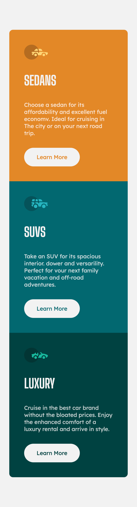
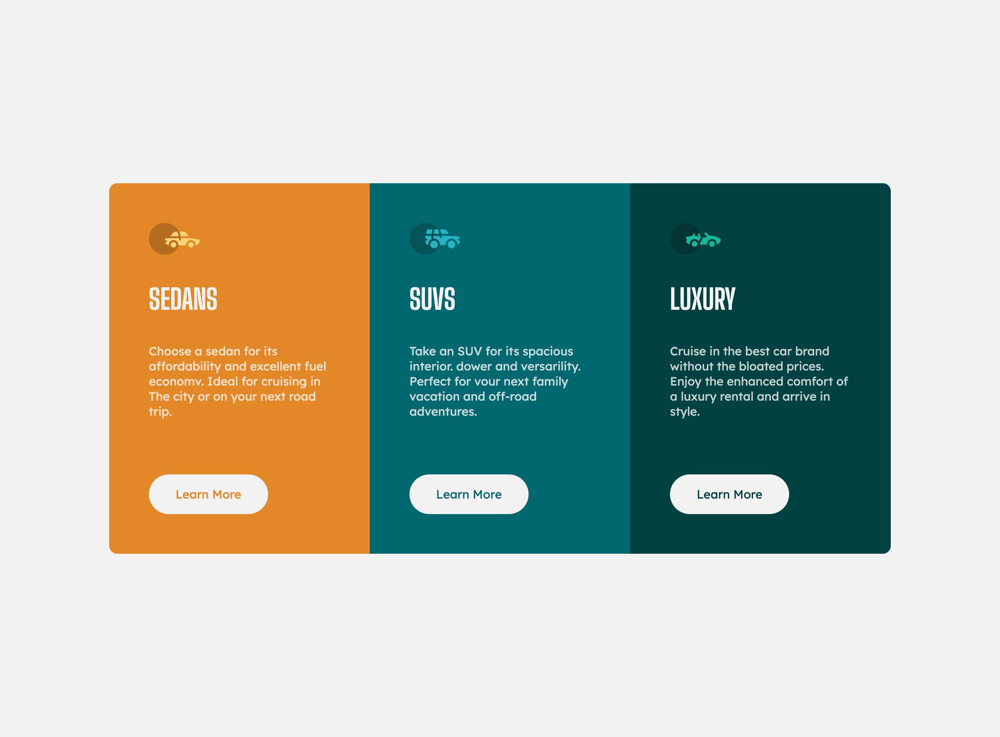

# Frontend Mentor - 3-column preview card component solution

This is a solution to the [3-column preview card component challenge on Frontend Mentor](https://www.frontendmentor.io/challenges/3column-preview-card-component-pH92eAR2-). Frontend Mentor challenges help you improve your coding skills by building realistic projects. 

## Table of contents

- [Overview](#overview)
  - [The challenge](#the-challenge)
  - [Screenshot](#screenshot)
  - [Links](#links)
- [My process](#my-process)
  - [Built with](#built-with)
  - [What I learned](#what-i-learned)
  - [Continued development](#continued-development)
  - [Useful resources](#useful-resources)
- [Author](#author)
- [Acknowledgments](#acknowledgments)

**Note: Delete this note and update the table of contents based on what sections you keep.**

## Overview

### The challenge

Users should be able to:

- View the optimal layout depending on their device's screen size
- See hover states for interactive elements

### Screenshot

Small-Screen Design        |  Large-Screen Design
:-------------------------:|:-------------------------:
  |  

### Links

- Solution URL: [solution URL](https://github.com/Twixii99/3-column-preview-card-component)
- Live Site URL: [live site URL](https://twixii99.github.io/3-column-preview-card-component/)

## My process

### Built with

- Semantic HTML5 markup
- CSS custom properties
- CSS Grid
- Mobile-first workflow

### What I learned

Making the design more dynamic by using local custom properties where each card can change whole color design by changing a single value.

```html
<div class="card" car-type="sedan">
  ...
</div>
<div class="card" car-type="suvs">
  ...
</div>
<div class="card" car-type="luxury">
  ...
</div>
```

```css
.card {
  background-color: var(--bg-color);
  ...
}

[car-type="sedan"] {
  --bg-color: var(--clr-primary-100);
}

[car-type="suvs"] {
  --bg-color: var(--clr-primary-200);
}

[car-type="luxury"] {
  --bg-color: var(--clr-primary-300);
}

.button {
  color: var(--bg-color);
  ...
}

.button:hover,
.button:focus-visible {
  background-color: var(--bg-color);
  ...
}
```

Each car-card has it's own custom property with certain color and all their children use this value.

## Author

- Website - [Mahmoud Kamal](https://www.linkedin.com/in/mahmoud-kamal-120176169/)
- Frontend Mentor - [@Twixii99](https://www.frontendmentor.io/profile/Twixii99)
- Twitter - [@MkBayumi](https://twitter.com/MkBayumi)
